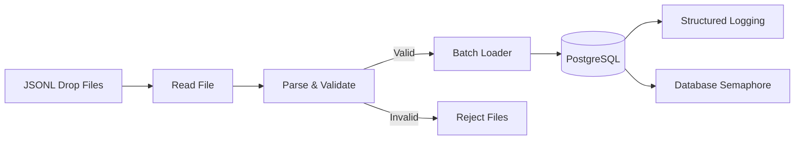

# 🚴 Trip Ingest

> A production-inspired data ingestion pipeline that validates JSONL trip data, loads valid records into PostgreSQL in batches, isolates invalid rows into reject files, and guarantees idempotent ingestion.


---

# Overview

Trip Ingest is a production-inspired batch ingestion pipeline built in Python.

The application processes trip events stored as JSONL files, validates every record, inserts valid rows into PostgreSQL in configurable batches, and writes invalid rows into dedicated reject files without interrupting the ingestion process.

The project was built to demonstrate engineering practices commonly found in modern data platforms, including streaming ingestion, idempotent loading, database migrations, automated testing, strict type checking, and containerized execution.

---

# Architecture



---

# Data Flow

```text
JSONL Files
     │
     ▼
Read line by line
     │
     ▼
Parse & Validate
     │
 ┌───┴────────┐
 │            │
 ▼            ▼
Valid      Invalid
 │            │
 ▼            ▼
Batch      Reject File
Insert
 │
 ▼
PostgreSQL
```

---

# Features

- Streaming JSONL ingestion
- Configurable batch inserts
- PostgreSQL persistence
- Idempotent loading using `ON CONFLICT DO NOTHING`
- Reject file generation for invalid records
- Structured logging
- Alembic database migrations
- Database-backed concurrency control
- Dockerized execution
- Automated testing with Pytest
- Strict static type checking with MyPy

---

# Tech Stack

| Category | Technology |
|----------|------------|
| Language | Python 3.11+ |
| Database | PostgreSQL 16 |
| Migrations | Alembic |
| Containerization | Docker & Docker Compose |
| Testing | Pytest |
| Static Analysis | MyPy |
| Dependency Management | uv |

---

# Project Structure

```text
trip-ingest/
│
├── alembic/
├── assets/
├── drops/
├── rejects/
├── sample-drops/
├── src/
│   └── trip_ingest/
│       ├── errors.py
│       ├── ingest.py
│       ├── loader.py
│       ├── migrate.py
│       ├── model.py
│       ├── reader.py
│       ├── settings.py
│       └── slots.py
│
├── tests/
├── Dockerfile
├── docker-compose.yml
├── pyproject.toml
└── README.md
```

---

# Quick Start

Clone the repository

```bash
git clone https://github.com/YoniAfengar/trip-ingest.git

cd trip-ingest
```

Start the required services

```bash
docker compose up -d
```

Run the ingestion pipeline

```bash
docker compose run --rm ingest
```

The application automatically:

- waits for PostgreSQL to become healthy
- applies database migrations
- processes all JSONL files
- writes invalid rows into reject files
- completes the ingestion job

---

# Running Tests

```bash
uv run pytest
```

Current status

```text
33 passed
3 deselected
```

---

# Static Type Checking

```bash
uv run mypy src
```

Current status

```text
Success: no issues found in 10 source files
```

---

# Engineering Decisions

## Streaming Processing

Input files are processed incrementally instead of loading the entire dataset into memory, allowing the pipeline to scale to larger files.

---

## Batch Loading

Trips are inserted into PostgreSQL in configurable batches to reduce database round trips and improve throughput.

---

## Idempotency

The loader uses PostgreSQL's `ON CONFLICT DO NOTHING`, making repeated executions safe without creating duplicate records.

---

## Reject Isolation

Invalid records never interrupt the ingestion process.

Each rejected row is written to a dedicated reject file together with the corresponding validation error.

---

## Database-backed Concurrency Control

A PostgreSQL-backed semaphore limits the number of concurrent ingestion jobs, preventing multiple workers from exceeding the configured capacity.

---

# Quality

- ✅ 33 automated tests
- ✅ MyPy strict type checking
- ✅ Dockerized environment
- ✅ Alembic database migrations
- ✅ Modular project structure

---

# Future Improvements

- CI/CD with GitHub Actions
- Prometheus metrics
- Retry policy for transient database failures
- Object storage support (S3-compatible)
- Workflow orchestration with Apache Airflow

---

# Author

**Yonatan Afengar**

Senior BI Developer transitioning into Data Engineering.

Passionate about building reliable data systems with Python, SQL, PostgreSQL, Docker, and modern engineering practices.