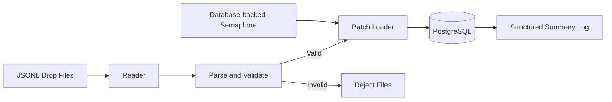

# 🚴 Trip Ingest

> A production-inspired data ingestion pipeline that validates JSONL trip data, loads valid records into PostgreSQL in batches, isolates invalid rows into reject files, and guarantees idempotent ingestion.


## Overview

Trip Ingest is a batch ingestion pipeline built in Python.

The application processes trip events stored as JSONL files, validates every record, inserts valid rows into PostgreSQL in configurable batches, and writes invalid rows into dedicated reject files without interrupting the ingestion process.

The project demonstrates practical data-engineering patterns, including incremental file processing, idempotent database loading, schema migrations, concurrency control, automated testing, strict type checking, and containerized execution.

## Contents

- [Architecture](#architecture)
- [Data Flow](#data-flow)
- [Features](#features)
- [Tech Stack](#tech-stack)
- [Project Structure](#project-structure)
- [Getting Started](#getting-started)
- [Testing](#testing)
- [Static Type Checking](#static-type-checking)
- [Engineering Decisions](#engineering-decisions)
- [Future Improvements](#future-improvements)
- [Author](#author)

## Architecture



## Data Flow

```text
JSONL files
     │
     ▼
Read each record
     │
     ▼
Parse and validate
     │
 ┌───┴────────┐
 │            │
 ▼            ▼
Valid      Invalid
 │            │
 ▼            ▼
Batch      Reject file
insert
 │
 ▼
PostgreSQL
```

## Features

- JSONL file ingestion
- Record parsing and validation
- Configurable batch inserts
- PostgreSQL persistence
- Idempotent loading with `ON CONFLICT DO NOTHING`
- Reject-file generation for invalid records
- Alembic database migrations
- Database-backed concurrency control
- Structured job-summary logging
- Dockerized execution
- Automated testing with Pytest
- Strict static type checking with MyPy

## Tech Stack

| Category | Technology |
|---|---|
| Language | Python 3.11+ |
| Database | PostgreSQL 16 |
| Database Driver | Psycopg 3 |
| Migrations | Alembic |
| Containers | Docker and Docker Compose |
| Testing | Pytest |
| Static Analysis | MyPy |
| Dependency Management | uv |

## Project Structure

```text
trip-ingest/
├── alembic/
├── assets/
│   └── screenshots/
├── drops/
├── rejects/
├── sample-drops/
├── src/
│   └── trip_ingest/
│       ├── __main__.py
│       ├── errors.py
│       ├── ingest.py
│       ├── loader.py
│       ├── migrate.py
│       ├── model.py
│       ├── reader.py
│       ├── settings.py
│       └── slots.py
├── tests/
├── Dockerfile
├── docker-compose.yml
├── pyproject.toml
└── README.md
```

## Getting Started

### Prerequisites

Install:

- Docker Desktop
- Git

### Clone the repository

```bash
git clone https://github.com/YoniAfengar/trip-ingest.git
cd trip-ingest
```

### Start the services

```bash
docker compose up -d
```

This starts:

- PostgreSQL
- pgAdmin

### Add input files

Place one or more `.jsonl` files inside:

```text
drops/
```

Example files are available in:

```text
sample-drops/
```

To copy them:

```bash
cp sample-drops/*.jsonl drops/
```

### Run the ingestion pipeline

```bash
docker compose run --rm ingest
```

The container:

1. waits for PostgreSQL to become healthy
2. applies Alembic migrations
3. processes every `.jsonl` file in `/data/drops`
4. loads valid rows into PostgreSQL
5. writes invalid rows to `/data/rejects`

### Stop the services

```bash
docker compose down
```

To also remove the database volumes:

```bash
docker compose down -v
```

## Testing

Install the development dependencies through `uv`, then run:

```bash
uv run pytest
```

Current result:

```text
33 passed, 3 deselected
```

The three deselected tests are excluded by the default Pytest configuration.

## Static Type Checking

```bash
uv run mypy src
```

Current result:

```text
Success: no issues found in 10 source files
```

## Engineering Decisions

### Incremental Processing

Input files are read one record at a time rather than loaded entirely into memory. This keeps memory usage predictable when processing larger files.

### Batch Loading

Valid trips are grouped into configurable batches before insertion. This reduces database round trips while preserving bounded memory usage.

### Idempotency

The loader uses:

```sql
ON CONFLICT (trip_id) DO NOTHING
```

This allows the same input to be processed again without creating duplicate trips.

### Reject Isolation

Invalid rows do not stop the job. Each rejected row is written to a separate JSONL file together with the validation error.

### Database Migrations

The application applies Alembic migrations before starting ingestion, ensuring that the required database schema exists before data is loaded.

### Concurrency Control

A PostgreSQL-backed semaphore limits ingestion concurrency to two active jobs. Permits are acquired for the duration of the job and released when execution finishes.

### Automated Quality Checks

The project includes:

- unit tests
- migration tests
- loader tests
- parsing tests
- concurrency tests
- source-size checks
- strict MyPy validation

## Future Improvements

- GitHub Actions CI/CD
- Apache Airflow orchestration
- S3-compatible object-storage support
- Prometheus metrics
- Retry handling for transient database failures

## Author

**Yonatan Afengar**

Senior BI Developer expanding into modern Data Engineering.

Focused on Python, SQL, PostgreSQL, Docker, data pipelines, and reliable backend data systems.