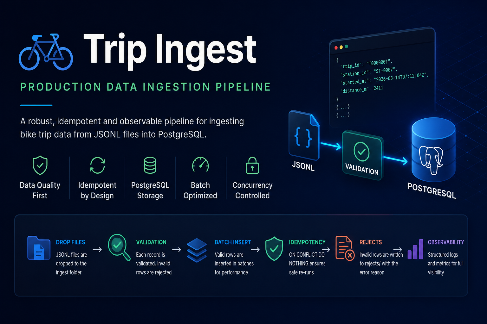
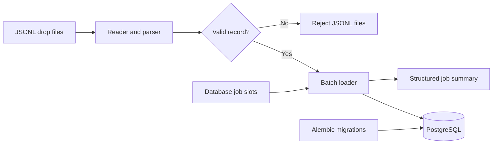
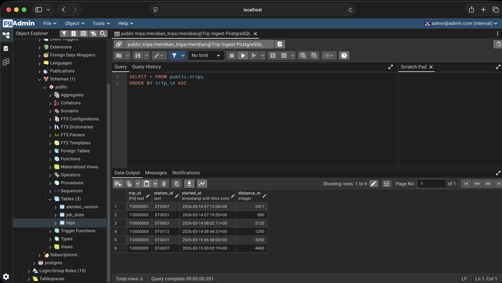

<p align="center">
  
</p>

# Trip Ingest

A Python ingestion pipeline that validates trip records from JSONL files, loads valid data into PostgreSQL in batches, isolates invalid records, and supports safe reruns without duplicate rows.

<p>
  
  
  
  
  
</p>

## Overview

Trip Ingest processes one or more `.jsonl` drop files and loads valid trip records into PostgreSQL.

For every input file, the application:

1. reads and parses each JSONL record
2. validates the required fields and values
3. collects valid trips for batched database insertion
4. writes invalid records to a dedicated reject file
5. reports the total rows read, loaded, and rejected

Database migrations run automatically before ingestion begins. A PostgreSQL-backed semaphore limits the number of simultaneous ingestion jobs.

## Architecture



## PostgreSQL Output

Validated trip records are stored in PostgreSQL using `trip_id` as the primary key.

<p align="center">
  
</p>

## Core Features

- JSONL file ingestion
- Record parsing and validation
- Configurable batched inserts
- PostgreSQL persistence with Psycopg
- Idempotent loading with `ON CONFLICT DO NOTHING`
- Reject files containing the original row and error reason
- Automatic Alembic migrations
- PostgreSQL-backed concurrency control
- Structured ingestion summaries
- Docker Compose environment
- Automated tests with Pytest
- Strict static type checking with MyPy

## Tech Stack

| Category | Technology |
|---|---|
| Language | Python 3.11+ |
| Database | PostgreSQL 16 |
| Database driver | Psycopg 3 |
| Migrations | Alembic |
| Containers | Docker and Docker Compose |
| Testing | Pytest |
| Type checking | MyPy |
| Dependency management | uv |

## Project Structure

```text
trip-ingest/
├── alembic/                  # Database migrations
├── assets/
│   ├── hero.png
│   └── screenshots/
│       └── trips-table.png
├── drops/                    # Incoming JSONL files
├── rejects/                  # Rejected rows and error reasons
├── sample-drops/             # Example input files
├── src/
│   └── trip_ingest/
│       ├── __main__.py       # Application entry point
│       ├── errors.py         # Domain-specific exceptions
│       ├── ingest.py         # Job orchestration
│       ├── loader.py         # Batched PostgreSQL loading
│       ├── migrate.py        # Alembic migration runner
│       ├── model.py          # Trip and Report models
│       ├── reader.py         # Parsing and validation
│       ├── settings.py       # Environment configuration
│       └── slots.py          # Database-backed semaphore
├── tests/
├── Dockerfile
├── docker-compose.yml
├── pyproject.toml
└── README.md
```

## Getting Started

### Prerequisites

Install:

- Git
- Docker Desktop

### Clone the repository

```bash
git clone https://github.com/YoniAfengar/trip-ingest.git
cd trip-ingest
```

### Start PostgreSQL and pgAdmin

```bash
docker compose up -d
```

Docker Compose starts:

| Service | Address |
|---|---|
| PostgreSQL | `localhost:55432` |
| pgAdmin | `http://localhost:8080` |

### Prepare input files

Place `.jsonl` files inside:

```text
drops/
```

Example files are available in `sample-drops/`:

```bash
cp sample-drops/*.jsonl drops/
```

### Run the ingestion pipeline

```bash
docker compose run --rm ingest
```

The container waits for PostgreSQL to become healthy, applies all pending migrations, and then processes every `.jsonl` file mounted under `/data/drops`.

Rejected records are written to:

```text
rejects/<drop-name>.rejects.jsonl
```

### Stop the services

```bash
docker compose down
```

To remove the PostgreSQL and pgAdmin volumes as well:

```bash
docker compose down -v
```

## Input Format

Each JSONL line represents one trip:

```json
{
  "trip_id": "T-0000001",
  "station_id": "ST-0007",
  "started_at": "2026-03-14T07:12:04Z",
  "distance_m": 2411
}
```

Required fields:

| Field | Description |
|---|---|
| `trip_id` | Unique trip identifier |
| `station_id` | Origin station identifier |
| `started_at` | ISO-formatted trip start timestamp |
| `distance_m` | Non-negative distance in metres |

## Reject Files

Invalid rows do not stop the ingestion job.

Each rejected record is written as a JSON object containing the original input and the validation error:

```json
{
  "row": "{\"trip_id\":\"T-9\",\"distance_m\":-50}",
  "error": "distance_m cannot be negative"
}
```

## Testing

Run the default test suite:

```bash
uv run pytest
```

Current result:

```text
33 passed, 3 deselected
```

The default Pytest configuration excludes three tests from the standard run.

## Static Type Checking

Run strict MyPy validation:

```bash
uv run mypy src
```

Current result:

```text
Success: no issues found in 10 source files
```

## Engineering Decisions

### Batched Database Loading

Valid trips are inserted in configurable batches instead of one row at a time. This reduces database round trips while keeping each insert operation bounded.

### Idempotent Reruns

The loader uses PostgreSQL conflict handling:

```sql
ON CONFLICT (trip_id) DO NOTHING
```

Processing the same data again does not create duplicate trips. PostgreSQL remains the authority for deciding which rows were actually inserted.

### Reject Isolation

Parsing or validation failures are handled per row. Invalid data is preserved with its error reason, while valid records from the same file continue through the pipeline.

### Database Migrations Before Loading

The application upgrades the database schema to the latest Alembic revision before processing any input data.

### Database-backed Concurrency Control

A PostgreSQL semaphore allows no more than two active ingestion jobs for the same job name. Permits are released reliably when the job exits.

### Clear Separation of Responsibilities

The project separates:

- parsing and validation
- database loading
- job orchestration
- schema migration
- configuration
- concurrency control

This keeps individual functions focused and independently testable.

## Future Improvements

- GitHub Actions for automated tests and type checking
- Retry handling for transient database failures
- Incremental streaming from parsing directly into the loader
- S3-compatible object-storage integration
- Prometheus metrics and operational dashboards
- Apache Airflow orchestration

## Author

**Yonatan Afengar**

Senior BI Developer expanding into modern Data Engineering, with a focus on Python, SQL, PostgreSQL, Docker, data pipelines, and reliable backend systems.